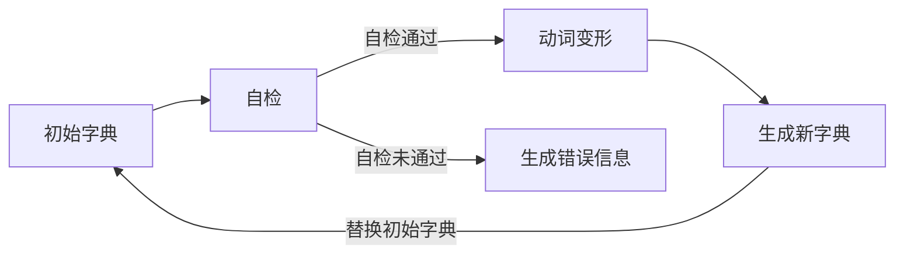
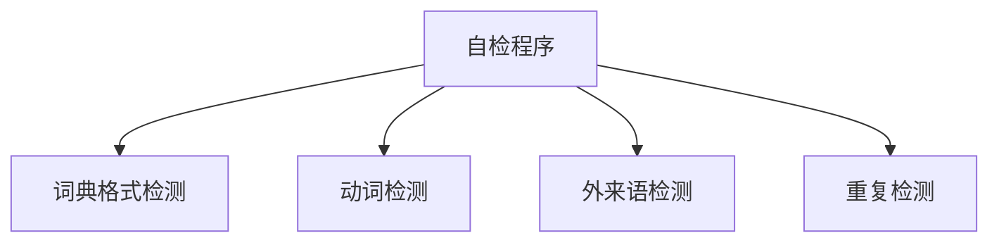

首先，使用字典格式固定且应当允许添加新词。添加新词后的字典若符合规范即可替代源词典，且保留初始版本以供回退。

字典应记录版本改动，若上次与本次未更改词典则跳过自检程序。或许会单独建立文件保存字典变更信息。

自检程序

查找

平假名片假名转换后进行查找

名词、形容词可能变为片假名

分优先级，汉字优先级最高，假名其次

字典添加新词自动检测相似位置 具体添加位置由添加者自行确认

动词分类及动词变形

在字典完场自检后生成各动词所有形态

当匹配到准确变形时索引其原型

针对完全由片假名组成的句子

将所有可能匹配方式列出

不同的词可能具有相同的假名写法 因此将假名写法主导汉字写法生成变形将有利于减少运算量

匹配 首先使用最大匹配法将与字典相匹配的词摘去

顺序抽取 可识别的动词 形容词副词 名词 剩余不可识别的词再进行判断

ABAB形词生成其片假名